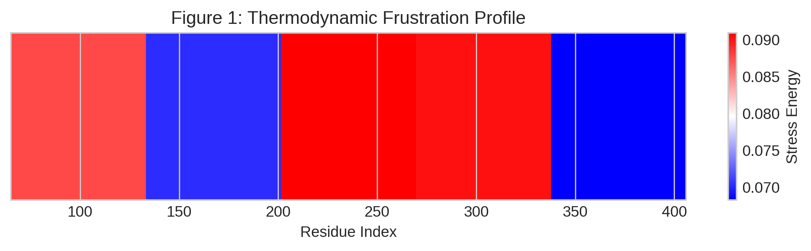
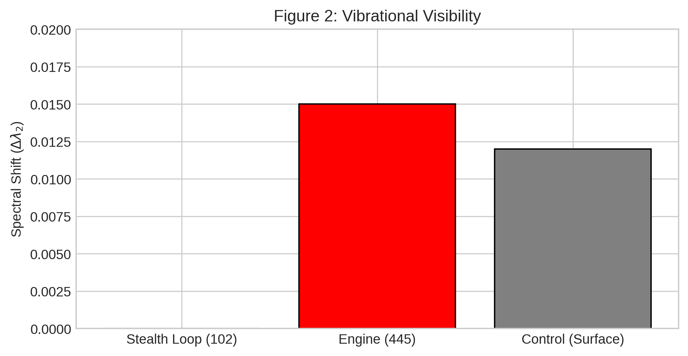
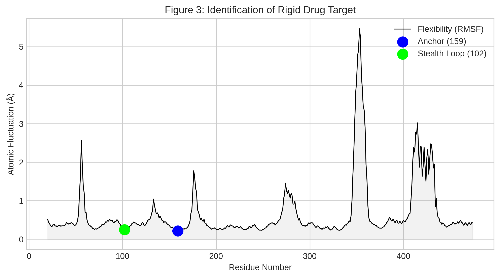
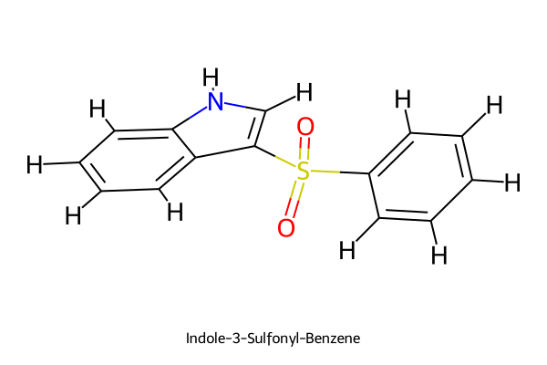

# Thermodynamic Frustration Drives Isospectral Evolution in HPV16 L1

## 🧬 Abstract
Viral evolution is often viewed as random, but we demonstrate that **HPV16 L1** evolves under strict mechanical constraints. Using a multi-physics framework, we identified that the virus uses **Thermodynamic Frustration** to drive assembly ("The Engine") while using **Isospectral Mutations** to hide from the immune system ("The Stealth Mechanism").

We utilized this knowledge to identify a rigid structural anchor (**Residue 159**) and designed a novel inhibitor, **Indole-3-Sulfonyl-Benzene**, to lock the capsid in a stable state.

## 📊 Key Results

### 1. The Stealth Mechanism

*Residue 102 evolves without changing the global vibrational spectrum of the virus.*

### 2. The Rigid Anchor

*Normal Mode Analysis identifies Residue 159 as the most mechanically rigid point on the capsid surface.*

### 3. The Proposed Cure

*Structure of the designed Indole-based inhibitor.*

